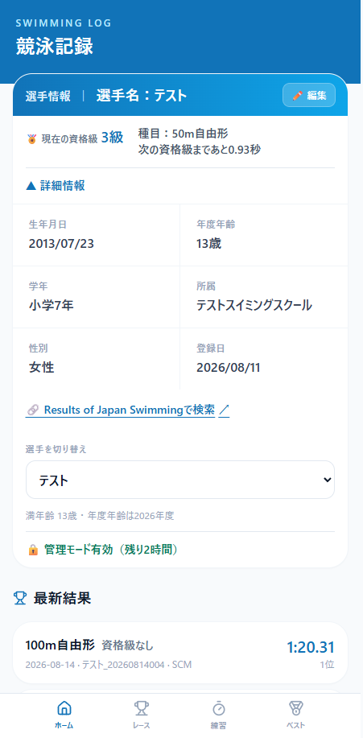
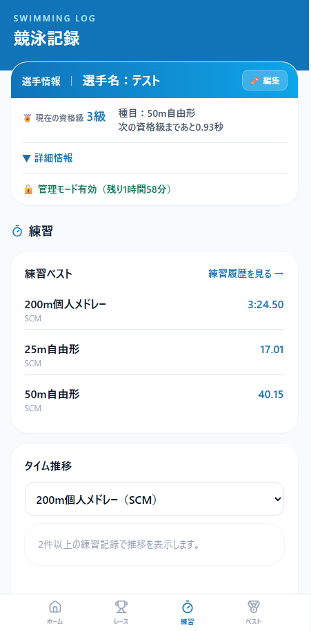
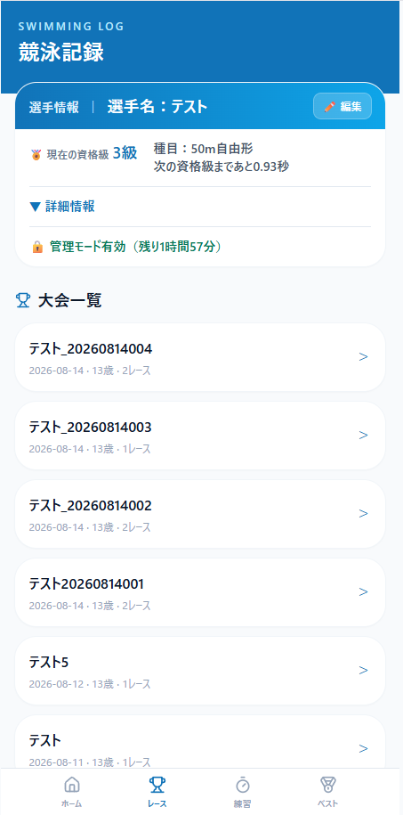
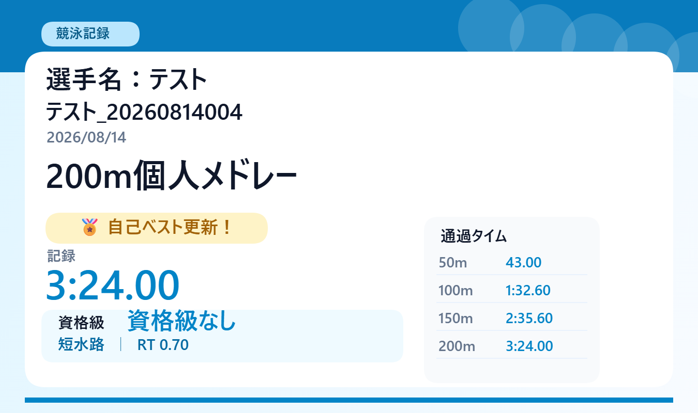

# SWIMLOG

競泳選手・保護者向けの、モバイル優先PWA記録管理アプリです。大会記録と練習記録を分けて管理し、Cloudflare Workers・D1・KV上で動作します。

> このリポジトリはGitHub Template Repositoryとして利用するための雛形です。個人情報、実レース記録、PIN、Webhook URLは含まれていません。

## スクリーンショット

| ホーム画面 | 練習記録 |
| --- | --- |
|  |  |

| レース記録 | レース結果共有 |
| --- | --- |
|  |  |

## 主な機能

- 大会レース記録の登録・編集・削除
- 練習記録、種目別ベスト、練習タイム推移
- RT、通過タイム、区間ラップの記録
- 資格級・JO標準の判定と次級との差分表示
- 自己ベスト、前回比較、大会サマリー
- レース・練習記録の共有画像生成
- Results of Japan Swimming 個人成績ページへのリンク
- 管理モード・追加モードによるPIN認証
- PIN総当たり対策（Cloudflare KV）とDiscord通知

## 技術構成

- Frontend: Next.js 15 / React 19 / TypeScript / Tailwind CSS
- Backend: Cloudflare Workers
- Database: Cloudflare D1
- Session lock state: Cloudflare KV
- Charts: Recharts
- Hosting: Cloudflare Workers static assets

## 初期セットアップ

### 1. テンプレートからリポジトリを作成

GitHub上で **Use this template** を選び、自分のリポジトリを作成します。その後、ローカルへcloneします。

```PowerShell
npm install
```

### 2. Cloudflareへログイン

```PowerShell
npx wrangler login
```

### 3. D1データベースを作成

```PowerShell
npx wrangler d1 create swimlog-db
```

出力された `database_name` と `database_id` を [wrangler.toml](./wrangler.toml) の `database_name` と `YOUR_DATABASE_ID` に設定します。

### 4. KV Namespaceを作成

PIN認証の失敗回数とロック状態に使う `PIN_LOCKS` Namespaceを作成します。

```PowerShell
npx wrangler kv namespace create PIN_LOCKS
npx wrangler kv namespace create PIN_LOCKS --preview
```

出力された本番IDとpreview IDを `wrangler.toml` の `YOUR_KV_NAMESPACE_ID`、`YOUR_KV_PREVIEW_NAMESPACE_ID` に設定します。

### 5. D1 Migrationを適用

`migrations/` の `0001` から最新番号までをWranglerが順番に適用します。

```PowerShell
# ローカルD1
npx wrangler d1 migrations apply DB --local

# リモートD1
npx wrangler d1 migrations apply DB --remote
```

現在のMigrationは `0001_initial.sql` から `0007_athlete_results_athlete_id.sql` までです。新しいMigrationを追加した場合も、同じコマンドで未適用分だけが適用されます。

架空のサンプルデータが必要な場合は、Migration適用後にローカルD1だけへ投入します。

```PowerShell
npm run seed
```

### 6. ローカルSecretを設定

雛形をコピーし、値はローカルだけに保存します。

```PowerShell
Copy-Item .dev.vars.example .dev.vars  # PowerShell
# cp .dev.vars.example .dev.vars       # macOS / Linux
```

| 変数 | 用途 |
| --- | --- |
| `ADMIN_PIN_HASH` | 管理モードPINのSHA-256ハッシュ |
| `ENTRY_PIN_HASH` | 練習記録追加専用PINのSHA-256ハッシュ |
| `DISCORD_WEBHOOK_URL` | PIN認証成功・ロック通知用のDiscord Webhook URL |

PINのハッシュは、たとえば次のコマンドで生成できます。平文PINをリポジトリやIssueへ貼り付けないでください。

```PowerShell
node -e "const crypto = require('crypto'); console.log(crypto.createHash('sha256').update(process.argv[1]).digest('hex'))" "YOUR_PIN"
```

`.dev.vars` は絶対にコミットしないでください。

### 7. ローカル起動

```PowerShell
# Next.js UIのみを確認
npm run dev

# Worker・D1・KVを含めて確認
npx wrangler dev
```

## 資格級データ設定

本リポジトリには、資格級・JO基準データは含まれていません。利用者自身で正規に入手した資料をもとにCSVを作成し、D1へ投入してください。先に「D1 Migrationを適用」まで完了させておく必要があります。

> **注意:** 資格級・JO基準値の著作権および利用条件は、利用者自身で確認してください。本テンプレートには基準値データを含みません。作成したCSVや変換後のSQLを公開リポジトリへコミットしないでください。

### CSV配置場所

プロジェクト直下に `data/` ディレクトリを作り、性別・年度ごとにCSVを配置します。

```text
data/
├── qualification_standards_female_2026.csv
└── qualification_standards_male_2026.csv
```

### CSV形式

文字コードはUTF-8、1行目は次のヘッダーにします。

```csv
gender,min_age,max_age,course,event,label,target_centis,effective_year
female,11,11,SCM,50m自由形,10級,3500,2026
```

上の数値はCSV形式を示す架空の例であり、公式な基準値ではありません。

| 項目 | 説明 | 例 |
| --- | --- | --- |
| `gender` | 適用する性別。アプリの選手データと同じ値を使う | `female` / `male` |
| `min_age` | 適用年齢の下限 | `11` |
| `max_age` | 適用年齢の上限 | `11` |
| `course` | 水路区分 | `SCM`（短水路）/ `LCM`（長水路） |
| `event` | 種目名。レース登録時の表記と完全に一致させる | `50m自由形` |
| `label` | 画面に表示する資格級名 | `10級` |
| `target_centis` | 基準タイムを100分の1秒単位の整数で指定する。`3500` は35.00秒 | `3500` |
| `effective_year` | 基準値の適用年度 | `2026` |

資格級CSVではD1の `system` を `grade` として投入します。JO基準を設定する場合も同じCSV形式を使い、後述の変換時に `$System = "JO"` を指定します。資格級とJOは別々のCSV・SQLにしてください。

### CSVをD1用SQLへ変換

現状のアプリにはJSON配列を受け取る `/api/standards/import` APIがありますが、CSVを直接取り込むスクリプトはありません。以下のPowerShellをプロジェクト直下で実行すると、2つの資格級CSVを `data/import_qualification_standards_2026.sql` へ変換できます。

```PowerShell
$CsvPaths = @(
  "data/qualification_standards_female_2026.csv",
  "data/qualification_standards_male_2026.csv"
)
$System = "grade" # JO基準を変換するときは "JO"
$SqlPath = "data/import_qualification_standards_2026.sql"

function ConvertTo-SqlText([string]$Value) {
  return "'" + $Value.Replace("'", "''") + "'"
}

$Statements = foreach ($CsvPath in $CsvPaths) {
  foreach ($Row in (Import-Csv -LiteralPath $CsvPath)) {
    $MinAge = [int]$Row.min_age
    $MaxAge = [int]$Row.max_age
    $TargetCentis = [int]$Row.target_centis
    $EffectiveYear = [int]$Row.effective_year
    $Id = "user:$System`:$EffectiveYear`:$($Row.gender):$MinAge`:$MaxAge`:$($Row.course):$($Row.event):$($Row.label)"

    "INSERT INTO qualification_standards " +
    "(id,effective_year,system,gender,min_age,max_age,course,event,label,target_centis) VALUES (" +
    "$(ConvertTo-SqlText $Id),$EffectiveYear,$(ConvertTo-SqlText $System),$(ConvertTo-SqlText $Row.gender)," +
    "$MinAge,$MaxAge,$(ConvertTo-SqlText $Row.course),$(ConvertTo-SqlText $Row.event)," +
    "$(ConvertTo-SqlText $Row.label),$TargetCentis) " +
    "ON CONFLICT(id) DO UPDATE SET target_centis=excluded.target_centis;"
  }
}

@("BEGIN TRANSACTION;", $Statements, "COMMIT;") |
  Set-Content -LiteralPath $SqlPath -Encoding utf8
```

変換後のSQLには基準値が含まれるため、元CSVと同様に公開リポジトリへコミットしないでください。別年度を作る場合は入力ファイル名と `$SqlPath` の年度を変更します。

### D1へ反映

最初にローカルD1へ投入して内容を確認します。

```PowerShell
npx wrangler d1 execute DB --local --file=./data/import_qualification_standards_2026.sql
npx wrangler d1 execute DB --local --command="SELECT effective_year, system, gender, COUNT(*) AS count FROM qualification_standards GROUP BY effective_year, system, gender ORDER BY effective_year, system, gender"
```

件数、年度、性別、資格級判定をローカルで確認できたら、自分のリモートD1へ反映します。

```PowerShell
npx wrangler d1 execute DB --remote --file=./data/import_qualification_standards_2026.sql
npx wrangler d1 execute DB --remote --command="SELECT effective_year, system, gender, COUNT(*) AS count FROM qualification_standards GROUP BY effective_year, system, gender ORDER BY effective_year, system, gender"
```

資格級判定には、選手の性別・レース日時点の年齢・水路・種目・年度に一致する `grade` の行が必要です。対象となる全区分をCSVへ用意したうえで、レースを登録して資格級が表示されることを確認してください。

## 本番デプロイ前の設定

1. `wrangler.toml` の `ENVIRONMENT` を `PRODUCTION` に変更します。
2. 本番D1・KVのIDが自分のCloudflareアカウントのものか確認します。
3. Cloudflare Workerへ3つのSecretを登録します。

```PowerShell
npx wrangler secret put ADMIN_PIN_HASH
npx wrangler secret put ENTRY_PIN_HASH
npx wrangler secret put DISCORD_WEBHOOK_URL
```

Secret登録コマンドはWorkerの新しいバージョンを作成するため、公開前の設定作業として実行してください。最後に通常のデプロイ手順を実行します。

```PowerShell
npm run deploy
```

Cloudflare Dashboardから公開する場合は、このGitHubリポジトリをWorkers Buildsへ接続し、ビルドコマンドを `npm run build`、デプロイコマンドを `npx wrangler deploy` に設定します。Secretはリポジトリや `wrangler.toml` へ保存せず、Cloudflare側で設定してください。

## GitHub公開前チェック

- `.dev.vars`、`.env`、Cloudflareの実リソースIDをコミットしない
- Webhook URL、PINハッシュ、トークン、個人情報、実レース・練習記録を含めない
- `wrangler.toml` のプレースホルダーが利用者自身の値へ置換されていることをデプロイ前に確認する
- `git status` とコミット対象の差分を確認してから公開する

公開者はGitHubのリポジトリ設定で **Template repository** を有効にします。利用者が **Use this template** で複製した後は、このREADMEの「初期セットアップ」から順に進めれば構築できます。

## デモデータと公開データ

- [scripts/seed.sql](./scripts/seed.sql) はローカル確認専用の明示的な架空デモ選手・レースデータです。本番DBには投入しないでください。
- `import_races.sql` と `import_splits.sql` からは個人の記録データを削除済みです。
- 資格級データや外部サイト由来のデータを配布する場合は、再配布可否を必ず確認してください。

## セキュリティ

Secret、脆弱性報告、個人データの扱いは [SECURITY.md](./SECURITY.md) を参照してください。

## ライセンス

[MIT License](./LICENSE)
